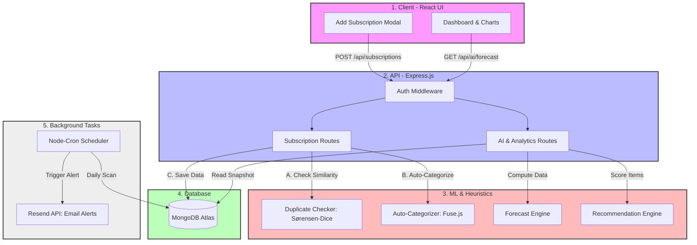
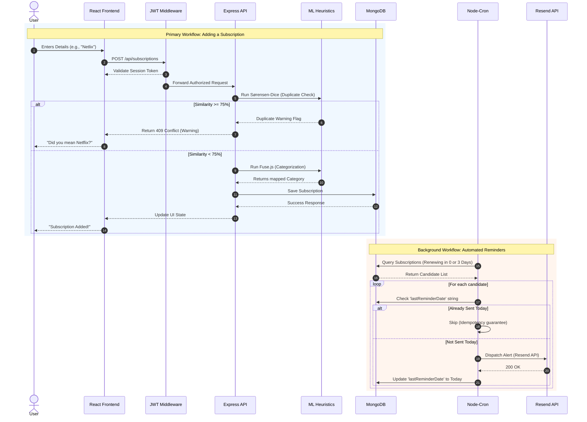
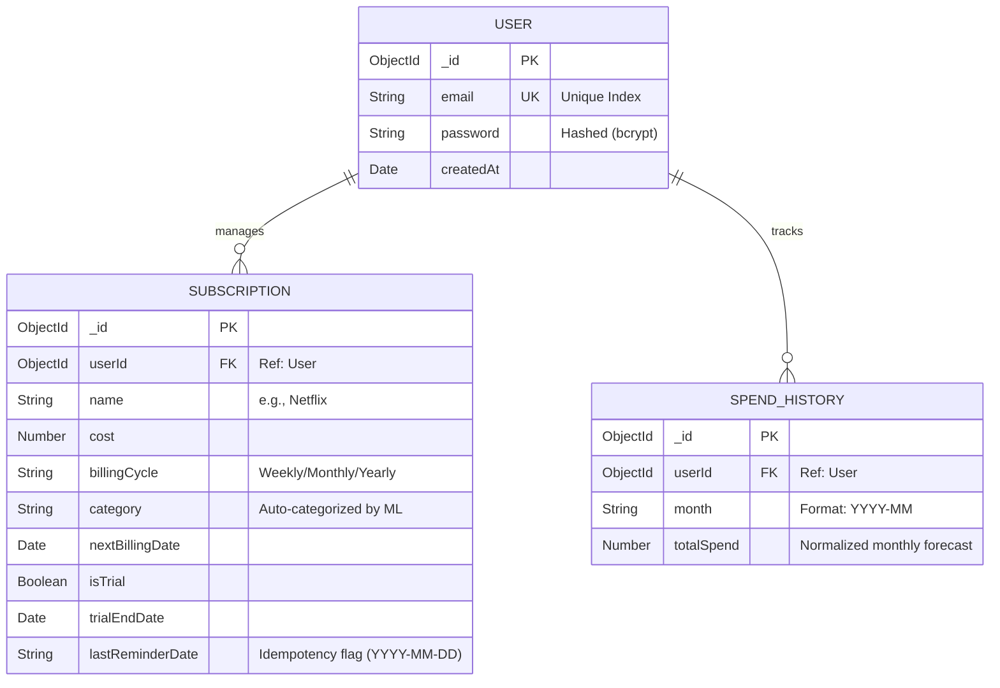

**The Problem**
- People often lose track of their various digital subscriptions and forget to cancel free trials ("subscription fatigue"). 
- This leads to surprise charges and wasted money.
- While apps exist to track these (like Rocket Money), they force users to link their actual bank accounts, which many privacy-conscious people refuse to do due to security risks. 
- On the other hand, tracking them manually in a spreadsheet is tedious and won't send you an alert when a bill is due.

**The Solution**
- This project is a privacy-first, bank-agnostic tracker. 
- It allows users to manually enter their subscriptions without ever linking a bank account. 
- In return, the app acts like a smart assistant: it visualizes your spending, predicts future costs, automatically categorizes services, and most importantly, 
- sends automated email alerts right before a subscription renews or a free trial expires so you never get accidentally billed again.

**Functional Requirements**
**Functional Requirements (What the system should do)**
- User Authentication: Users must be able to securely register and log in (JWT-based session management).
- Manual Subscription Management (CRUD): Users can manually add, read, update, and delete their subscriptions without linking bank accounts.
- Automated Email Notifications: The system must run a daily background scheduler to identify subscriptions renewing today or in 3 days and dispatch automated reminder emails.
- Smart Auto-Categorization: When a user adds a subscription without a category, the system should automatically categorize it using a fuzzy-search algorithm against common services.
- Duplicate Detection Warning: The system must alert the user if they attempt to add a subscription that sounds similar to an existing one (e.g., "Netlix" vs "Netflix").
- Dashboard & Analytics: The system must aggregate spending data, normalize different billing cycles (weekly, yearly) to a monthly basis, and visualize spending trends via charts.
- Cancellation Recommendations: The system must analyze the user's subscriptions and generate cancellation recommendations ("Keep", "Monitor", "Consider", "Cancel") based on trial status, cost, and category essentiality.
- Data Export: Users must be able to export their subscription data to a local CSV file.

**Non-Functional Requirements (How the system should behave)**
- Privacy & Security First: Bank-agnostic by design (no third-party financial API integrations like Plaid). Passwords must be hashed (bcrypt), and sessions secured via JWT.
- High Performance (O(1) Dashboard Loads): The dashboard must load analytical data instantly by querying pre-calculated monthly snapshot databases (SpendHistory) instead of computing totals on the fly.
- Idempotency (No Duplicate Emails): The background scheduler must guarantee that a user never receives the same email reminder twice, even if the server crashes or restarts during a cron cycle.
- Resource Efficiency: The system must use lightweight local algorithms (like Sørensen-Dice string similarity and Fuse.js) instead of heavy, expensive external Machine Learning models to save computing costs.
- Reliability: Background tasks should operate asynchronously without blocking or slowing down the core user API.

**Edge Cases to Handle**
- Varying Billing Cycles: Normalizing different payment frequencies (Weekly $\times 4.33$, Yearly $\div 12$) into a flat monthly forecast so the user gets an accurate monthly burn rate.
- Server Restarts During Cron Jobs: If the server restarts while sending bulk email reminders, the system must know exactly who was already emailed to prevent spamming users. (Handled via updating lastReminderDate).
- Typographical Errors by Users: Users might accidentally enter duplicate services with typos. The system must catch this using string distance similarities $\ge 0.75$.
- Legacy User Sessions: If the structure of the authentication token (JWT) changes in the future (e.g., adding an email address to the token payload), the system must elegantly fall back to database lookups so older logged-in users aren't suddenly kicked out or crashed.
- Free Trial Conversions: Users often add free trials but forget the end date. The system must treat trials with higher priority/risk and flag them as "Monitor" to ensure cancellation before a charge occurs.

**Success Criteria**
- User Adoption & Privacy: Users can fully utilize the application to track their subscriptions without ever being asked for or storing bank credentials.
- Notification Reliability (Zero Defects): 100% of reminder emails for upcoming renewals and expiring free trials are dispatched successfully on time (0-day and 3-day marks).
- Idempotency Guarantee: The system achieves a 0% duplicate email rate during server restarts or concurrent cron job executions.
- System Performance: The analytics dashboard loads instantly ($O(1)$ database query complexity), regardless of how many months of history a user has accumulated.
- Data Accuracy: The system accurately normalizes disparate billing cycles (e.g., weekly, yearly) into a cohesive, mathematically correct flat monthly projection.
- Error Prevention: The duplicate detection system successfully flags potential duplicate entries with $\ge 75\%$ similarity, preventing users from adding identical services.
- Actionable Insights: The recommendation engine accurately classifies subscriptions into "Cancel," "Consider," "Monitor," or "Keep" based on the predetermined multi-factor heuristic scoring system.

**Phase 2: Design**

**4. High-Level Solution Architecture**

**Core Architecture Pattern:**
Decoupled Client-Server Architecture using the MERN stack (MongoDB, Express, React, Node.js). 
The system avoids heavy external Machine Learning APIs, opting instead for localized heuristic and string-matching algorithms to minimize computing costs, reduce latency, and ensure maximum data privacy.

**System Components:**
1. **Client Layer (Frontend):**
   * Built with React.js and Tailwind CSS for a responsive, modern UI.
   * Handles user interactions, visualizes spending with Recharts, and manages component state locally.
   * Communicates with the backend asynchronously via Axios REST calls.

2. **API Layer (Backend REST Server):**
   * Express.js server that processes incoming HTTP requests.
   * Secures endpoints via JWT (JSON Web Tokens) verification middleware.
   * Exposes distinct routing controllers: `userRoutes` (Auth), `subscriptionRoutes` (CRUD operations), and `aiRoutes` (Analytics & Internal ML Predictions).

3. **Database Layer (Storage & Snapshots):**
   * MongoDB Atlas managed via Mongoose ODM.
   * Composed of three primary collections:
     * `User`: Stores credentials and settings.
     * `Subscription`: Stores individual tracking records and alert states (`lastReminderDate`).
     * `SpendHistory`: Dedicated snapshot collection that aggregates monthly totals, ensuring fast dashboard load times without doing heavy database math on the fly.

4. **Background & ML/AI Layer (Internal Services):**
   * **Task Scheduler:** `node-cron` runs a background loop to process data, update monthly snapshots, and trigger Resend API email notifications for 0-day and 3-day renewals.
   * **Fuzzy Categorization Service:** Uses `Fuse.js` to automatically assign categories to new subscriptions based on a local database dictionary (e.g., mapping Netflix to "Entertainment").
   * **Duplicate Detection Service:** A custom-built Sørensen-Dice string distance algorithm that catches user typos to prevent duplicate entries (e.g., warning a user adding "Netlix" when "Netflix" exists).
   * **Recommendation & Forecast Engine:** Normalizes billing cycles (weekly vs. yearly) and scores subscriptions to suggest cancellation priorities based on a heuristic combining cost, trial status, and category.

**Architecture Flow Diagram:**



**5. System Workflow Diagram**

The sequence diagram below illustrates the two primary data lifecycles in the application: the synchronous user workflow (adding a subscription with ML intervention) and the asynchronous background worker loop (sending reliable email alerts).



**6. Modules & Services Breakdown**

To ensure a decoupled and maintainable codebase, the application is logically separated into the following independent modules and micro-services:

*   **Module 1: User & Authentication Service**
    *   *Responsibilities:* User registration, login session tracking, JWT token generation, and secure password hashing.
    *   *Core Components:* `userRoutes.js`, `authMiddleware.js`, `User Schema`.
*   **Module 2: Subscription Management Service (Core CRUD)**
    *   *Responsibilities:* Adding, reading, updating, deleting, and fetching core subscription documents for the logged-in user.
    *   *Core Components:* `subscriptionRoutes.js`, `Subscription Schema`.
*   **Module 3: Analytics & Forecasting Service**
    *   *Responsibilities:* Normalizing diverse billing cycles (weekly/yearly $\rightarrow$ monthly), analyzing 3-month spending history, and calculating the total monthly burn rate to display on the dashboard.
    *   *Core Components:* `forecastService.js`, `SpendHistory Schema`, `aiRoutes.js`.
*   **Module 4: Machine Learning / Heuristic Engine**
    *   *Responsibilities:* Automatically mapping "Other" categories to proper tags via fuzzy search, running Sørensen-Dice string matching to detect user typos and duplicates, and executing multi-factor scoring to suggest cancellation priorities (Cancel, Consider, Monitor, Keep).
    *   *Core Components:* `categorizationService.js`, `duplicateService.js`, `recommendationService.js`.
*   **Module 5: Background Task & Notification Worker**
    *   *Responsibilities:* Operating asynchronously from the core API, this module runs daily cron schedules, queries the database for 0-day and 3-day renewal dates, enforces idempotency using the `lastReminderDate` flag, and dispatches external emails.
    *   *Core Components:* `reminderCron.js`, Resend API Integration.
*   **Module 6: Frontend Client App**
    *   *Responsibilities:* Rendering responsive UI components, managing client-side React state, visualizing JSON payload data using Recharts, and routing navigation without page reloads.
    *   *Core Components:* `Dashboard.js`, `SpendingCharts.js`, `SubscriptionTable.js`, `AddSubscriptionModal.js`.

**7. Database Schema Design**

The application uses MongoDB (NoSQL) with Mongoose acting as the Object Data Modeling (ODM) layer. The database design is kept lean to ensure $O(1)$ dashboard loading, utilizing three core collections.

**Entity-Relationship Diagram:**



**Key Indexing & Data Integrity Strategies:**
1.  **Compound Unique Indexing:** The `SpendHistory` collection uses a compound unique index on `{ userId: 1, month: 1 }`. This guarantees that the background cron job can safely execute multiple times without ever creating duplicate analytics snapshots for a user in a given month.
2.  **Lean Document Retrieval:** Because analytic dashboard queries are read-only, we employ Mongoose's `.lean()` method to skip hydrating full Mongoose instances. This dramatically lowers the server memory footprint.
3.  **Idempotency State Field:** The `lastReminderDate` inside the `Subscription` schema serves as an internal state machine flag. When an email goes out, this field updates immediately. The cron query filters this out (`lastReminderDate: { $ne: targetStr }`), preventing duplicate email dispatches.

**8. API Contracts (Request/Response)**

The application communicates via RESTful JSON payloads. All protected routes require a valid JWT in the `Authorization: Bearer <token>` header.

### Authentication
**1. Login / Register**
*   `POST /api/users/login`
*   **Request Body:**
    ```json
    { "email": "user@example.com", "password": "securepassword" }
    ```
*   **Success Response (200 OK):**
    ```json
    {
      "token": "eyJhbGciOiJIUzI1NiIsIn...",
      "user": { "id": "60d...", "email": "user@example.com" }
    }
    ```

### Subscriptions (CRUD & ML)
**2. Add Subscription**
*   `POST /api/subscriptions`
*   **Request Body:**
    ```json
    {
      "name": "Netlix",
      "cost": 15.99,
      "billingCycle": "Monthly",
      "isTrial": false
    }
    ```
*   **Success Response (201 Created):**
    *(Note: The server auto-categorizes "Netlix" to "Entertainment")*
    ```json
    {
      "message": "Subscription added successfully",
      "data": {
        "id": "60d...",
        "name": "Netlix",
        "category": "Entertainment",
        "cost": 15.99
      },
      "warnings": [
        { "type": "DUPLICATE_DETECTED", "message": "Similar subscription 'Netflix' already exists." }
      ]
    }
    ```

### AI / Analytics
**3. Fetch Dashboard Analytics & Forecasts**
*   `GET /api/ai/forecast`
*   **Response (200 OK):**
    ```json
    {
      "monthlyBurnRate": 45.99,
      "trend": "Increasing",
      "history": [
        { "month": "2026-03", "totalSpend": 30.00 },
        { "month": "2026-04", "totalSpend": 45.99 }
      ]
    }
    ```

**4. Fetch Cancellation Recommendations**
*   `GET /api/ai/recommendations`
*   **Response (200 OK):**
    ```json
    {
      "recommendations": [
        {
          "subscriptionId": "60d...",
          "name": "Hulu",
          "score": 35,
          "action": "CANCEL",
          "reason": "Free trial expires in 2 days."
        }
      ]
    }
    ```
